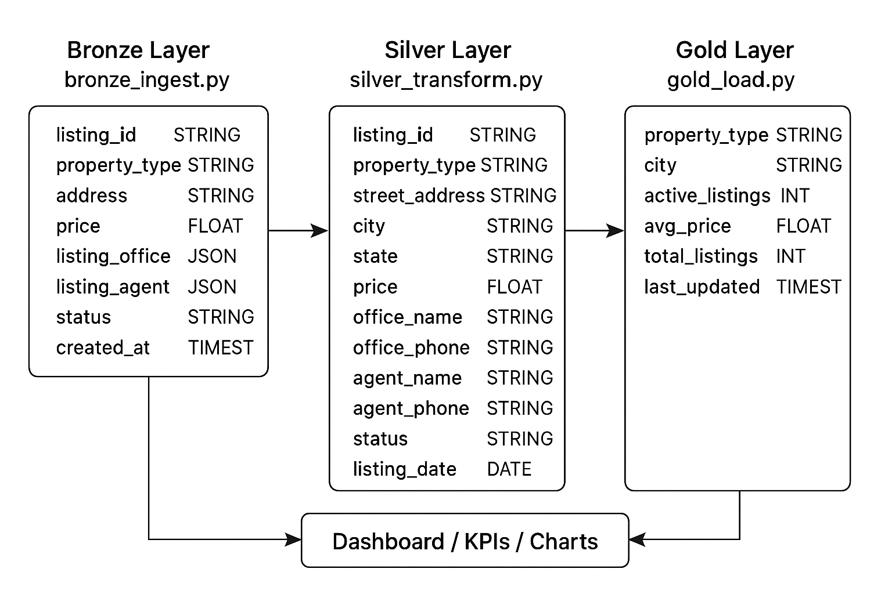

# Zipco Real Estate Data Pipeline

## Overview

The Zipco Real Estate ETL Project automates the ingestion, transformation, and analysis of active sales listings and active rental listings for Zipco Real Estate Agency. The primary goal is to capture and maintain up-to-date property data and prepare it for useful business insights via analytics dashboards.

The roadmap i took to implement this project was the Medallion Architecture (Bronze → Silver → Gold), ensuring clean, reliable, and analytics-ready data.

---

## Key Objectives
- --Ingest active property listings (sales and rentals) from  www.rentCast.io
- --Transform and standardize the raw data into structured formats.
- --Automate updates using script at the Gold Layer
- --Model the data for analytics using a star-schema design.
- --Provide dashboards (Power BI or other BI tools) for insights on:
  -- Number of active listings (sales & rentals)
  --Average prices and rental rates
  --Location-based trends
  --Top-performing agents/offices

---

## Architecture

##.png>)

##

### Medallion Layers:
1. At the Bronze Layer:
   - Raw API JSON data captured for sales and rentals.
   - Stored as JSON/Parquet files or in a staging table.
2. At the Silver Layer:
   - Cleaned and normalized data.
   - Handled nested JSON fields (e.g., agent, office info).
   - Removed duplicates, fixed data types.
3. At the Gold Layer:
   - Analytics-ready data model using the star schema approach (facts and dimensions).
   - Aggregations for dashboards (e.g., active listings count, price distributions).

Medallion pipeline flow with scripts to drive the process

        ┌─────────────┐
        │ config.py   │
        │ utils.py    │
        │ logging_*.py│
        └─────┬───────┘
              │
              ▼
    ┌───────────────────┐
    │ bronze_ingest.py   │  ← Pulls raw data into Bronze layer
    └─────────┬─────────┘
              │
              ▼
    ┌───────────────────┐
    │ silver_transform.py│  ← Cleans & transforms data into Silver layer
    └─────────┬─────────┘
              │
              ▼
    ┌───────────────────┐
    │ gold_load.py       │  ← Prepares Gold tables for analytics
    └─────────┬─────────┘
              │
              ▼
    ┌───────────────────┐
    │ etl_pipeline.py    │  ← Orchestrates ETL steps (Bronze→Silver→Gold)
    │ medallion_etl_dag.py │  ← DAG for scheduling / Airflow
    └─────────┬─────────┘
              │
              ▼
    ┌───────────────────┐
    │ dashboard.py       │  ← Reads Gold tables & displays KPIs, charts, filters
    └───────────────────┘

---
### Configuration / Utilities

config.py → ✅ Holds project-wide settings (DB connections, file paths, API keys). Essential.

utils.py → ✅ Helper functions (parsing, transformations, reusable code). Very useful.

logging_config.py → ✅ Configures logging settings for the pipeline.

#### ETL Pipeline

bronze_ingest.py → ✅ Pulls raw data from source and stores in Bronze layer.

silver_transform.py → ✅ Transforms Bronze data into Silver (cleaned, enriched).

gold_load.py → ✅ Loads Silver data into Gold tables for analytics.

etl_pipeline.py → ✅ Likely orchestrates the ETL steps in sequence.

medallion_etl_dag.py → ✅ DAG definition (for Airflow or orchestration).

etl_logging.py → ✅ Adds logging around ETL runs (errors, success).

logging_monitoring.py → Optional but helpful for monitoring/log alerts.

### Dashboard / Visualization

dashboard.py → ✅ Handles KPIs, charts, filters, Streamlit or other dashboards.

### Summary of Relevance
Script	                  Role	Relevance
config.py	               Settings	✅
utils.py	                  Helpers	✅
logging_config.py	         Logging setup	✅
logging_monitoring.py	   Monitoring & alerts	⚪ optional
bronze_ingest.py	         ETL Bronze layer	✅
silver_transform.py	      ETL Silver layer	✅
gold_load.py	            ETL Gold layer	✅
etl_pipeline.py	         Orchestration	✅
etl_logging.py	            Logging in ETL	✅
medallion_etl_dag.py	      Orchestrator/DAG	✅
dashboard.py	            Analytics/Visualization	✅


## Technologies Used
- --Python: API ingestion and ETL scripts.
- --Pandas / PySpark: Data transformation.
- --PostgreSQL : Storage layers.
- --GitHub: Version control & CI/CD .
- --Streamlit : Dashboard and analytics.

---

## Automation

- --Windows Task Scheduler runs ETL scripts at defined intervals ( daily at 2:00AM) to ensure data stays current.
- Alternatively, GitHub Actions or other schedulers can trigger the pipeline in cloud environments.

Task Scheduler command (batch file):
```bat
@echo off
"C:\Path\to\python.exe" "C:\etl_project\etl_pipeline.py"
